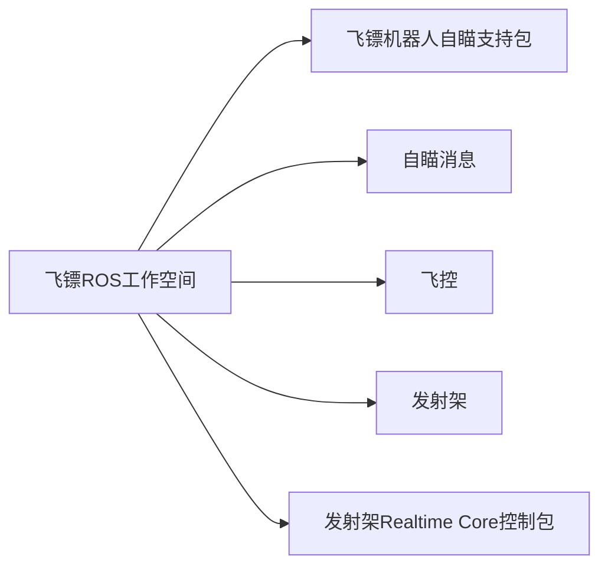

# 飞镖ROS工作空间
> 本工作空间是飞镖机器人的ROS工作空间，包含了飞镖机器人自瞄支持包、自瞄消息、飞控、发射架、发射架`Realtime Core`控制包。

```mermaid
graph LR
    A[飞镖ROS工作空间] --> B[飞镖机器人自瞄支持包]
    A --> C[自瞄消息]
    A --> D[飞控]
    A --> E[发射架]
    A --> F[发射架Realtime Core控制包]
```