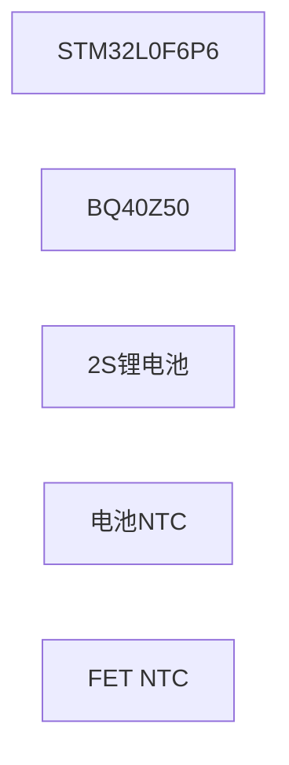

# BMS系统
## 系统规格
- 电池类型：锂电池
- 电池电压：2s, 7.4V
- 电池容量：300mAh
- 电池充电电流：2~4A
- 电池放电电流：6A (典型) 10A (峰值)
## 系统架构

```mermaid
graph LR
    A[STM32L0F6P6]
    B[BQ40Z50]
    C[2S锂电池]
    D[电池NTC]
    E[FET NTC]

```