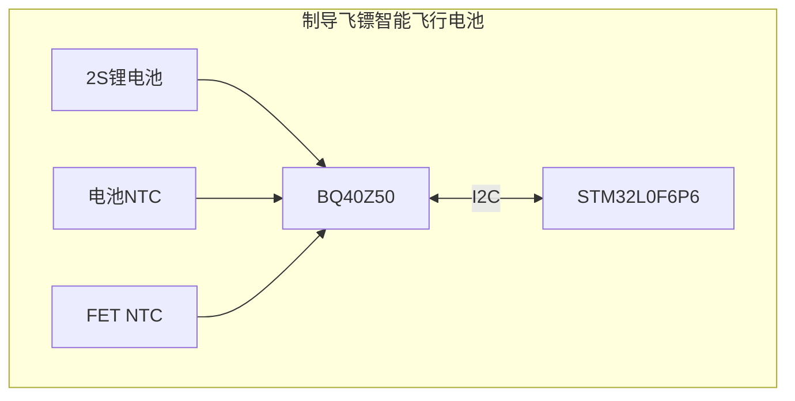
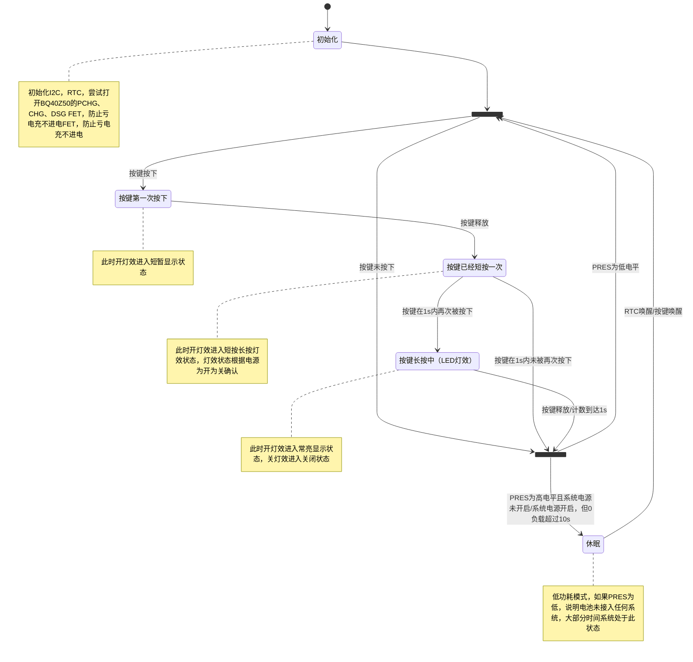
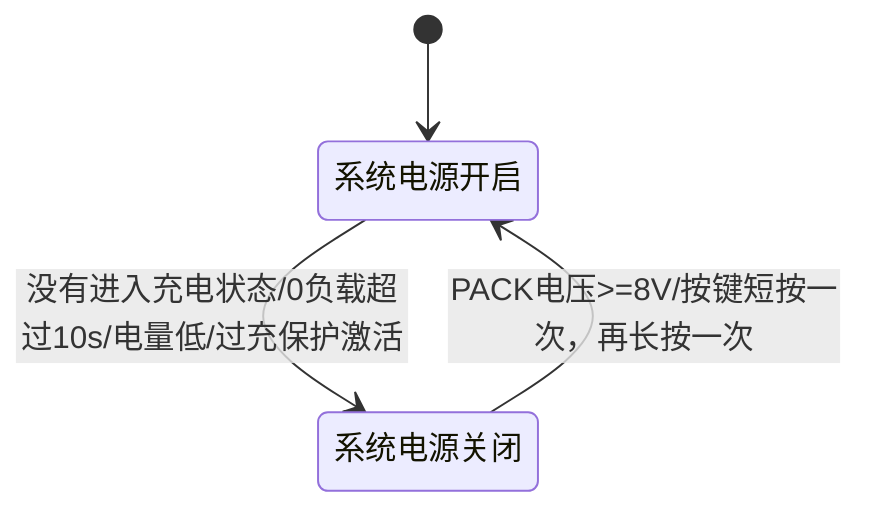
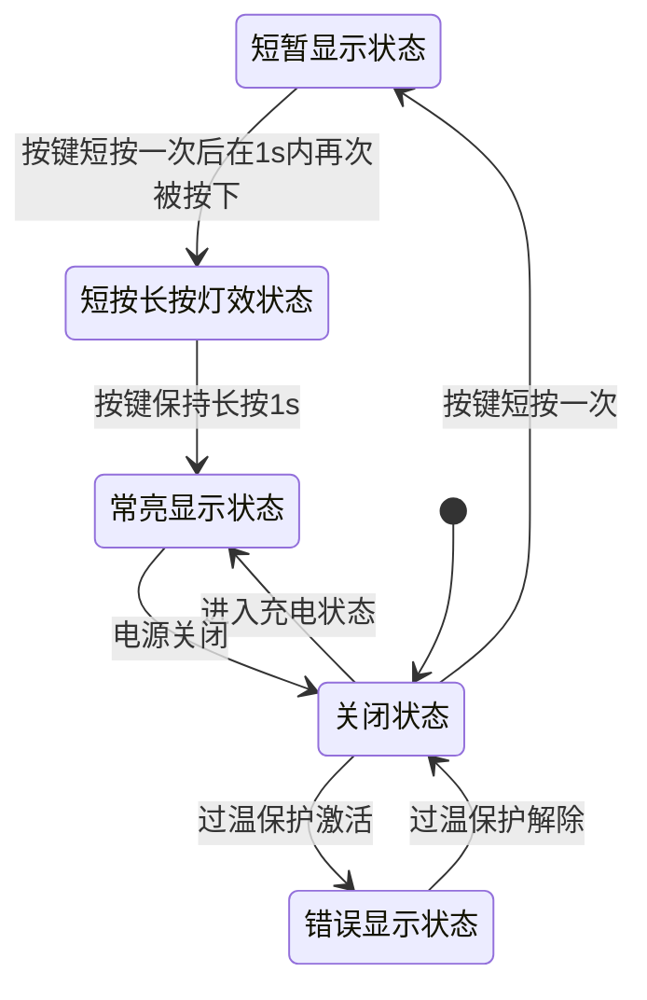

# BMS系统
## 系统规格
- 电池类型：锂电池
- 电池电压：2s, 7.4V
- 电池容量：300mAh
- 电池充电电流：2~4A
- 电池放电电流：6A (典型) 10A (峰值)
## 系统架构

## 系统状态机
> 因为低功耗需要，系统使用裸机开发，不使用RTOS

BMS状态机

系统FET电源状态机

> 电源是否开启取决于BQ40Z50内部的CHG、DSG FET是否打开，必须实时更新。

系统灯效状态机

